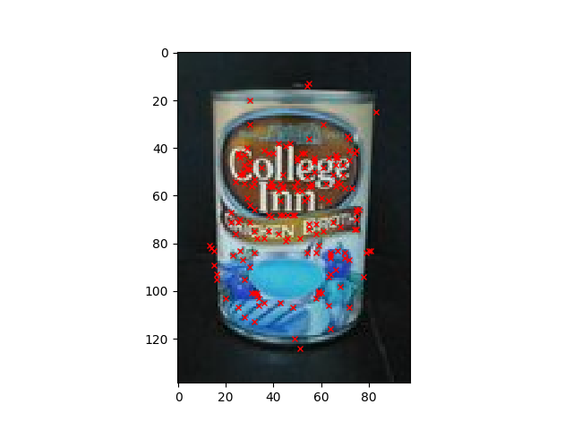
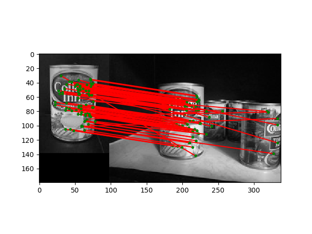

# Feature Descriptors, Planar Homography Estimation, Panoramic Stitching

-----------------------
Keypoint features for can

-----------------------

Feature matching for can

-----------------------

Feature matching for book

-----------------------

Left and right Image before stitching

 

-----------------------

Stitched panoramic image

-----------------------